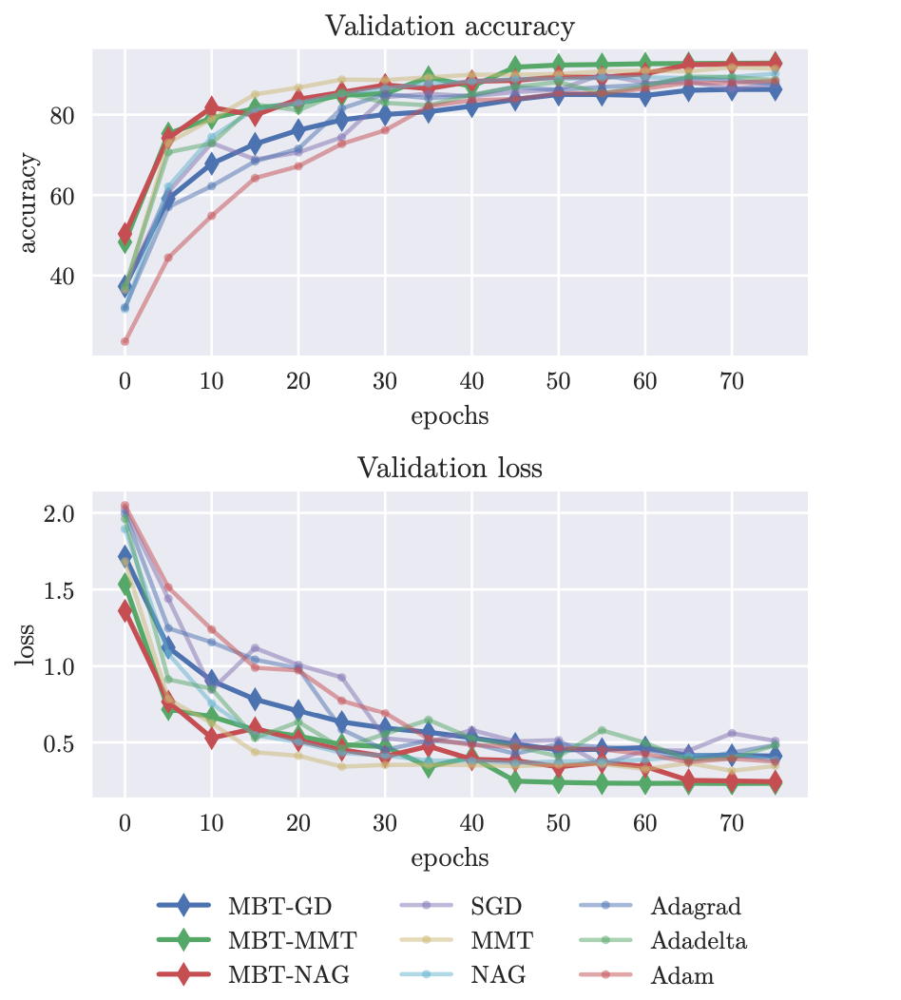
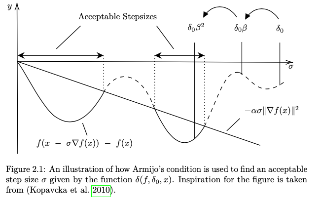

# A Comparison of Gradient Descent Methods Using Backtracking Line Search

## Accompanying code for the project work in MAT2000, written under supervision of Tuyen Trung Truong

## Originally forked from [MBT-optimizer](https://github.com/hank-nguyen/MBT-optimizer) and based off the work of Tuyen Trung Truong and Tuan Hang Nguyen. 

### Abstract

We investigate the performance of backtracking line search applied to three different gradient descent optimization methods. The methods in question are 1) standard gradient descent, 2) gradient descent with momentum and 3) Nesterov accelerated gradient descent. To first visualize how the different methods move towards a minimum, we apply them to the Rosenbrock function in R2. Then we look at the performance when performing image recognition on the CIFAR10 data set using the deep neural network ResNet18. We find that α = 10−4 and β = 0.5 are good stable hyperparameters for backtracking line search. Then we describe an algorithm for applying backtracking to mini-batch learning, where we switch the α-value to 0.5 if the loss or accuracy becomes worse during training. The deep neural network is trained for 75 epochs on each optimization method, and we find that the backtracking methods perform well both in regards to accuracy and loss. The mini-batch two way backtracking with momentum is the most accurate at 93%. Further we perform a comparative measure of the time efficiency of the different methods. The result suggest that the backtracking methods are slower if we do not account for learning rate tuning.

 

